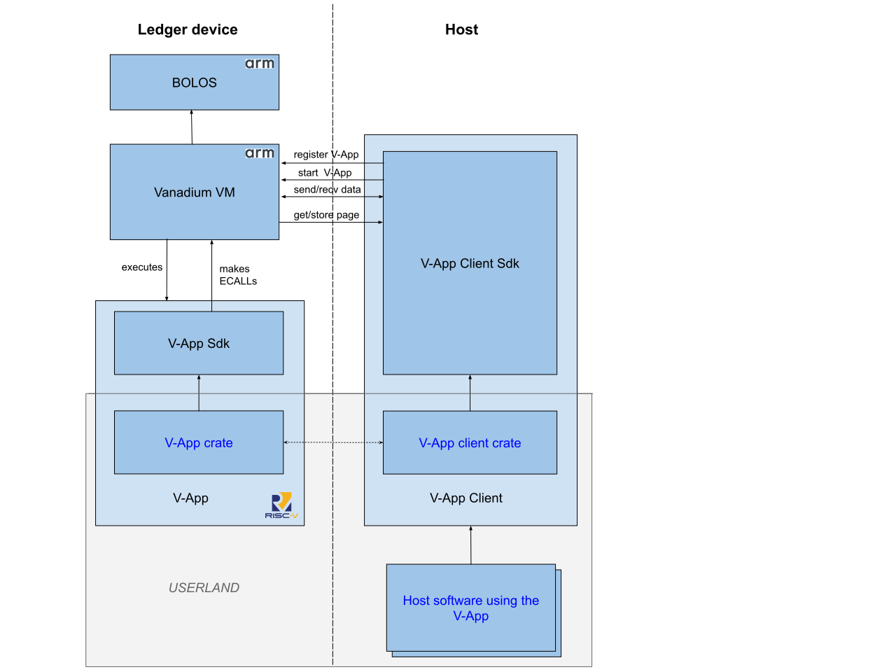

# Compilation targets

All crates used by V-Apps use explicit features in order to distinguish which compilation environment the V-App is going to run. For most such crates, exactly one of these features must be selected at compilation time.

Here are the currently defined target features:

- `target_native`: indicates compilation of a V-App for the *native* environment, which is what runs on your machine. With this target, V-Apps run as a process that communicates with the client via a socket. This is typically the default and is ***only*** used for development and testing.
- `target_vanadium_ledger`: indicates compilation of a V-App for execution on the Ledger Vanadium VM app. Depending whether the device is a simulated device on Speculos or a real device, the Transport protocol would use tcp or the HID interface. The actual compilation target for this feature is `riscv32imc-unknown-none-elf`.

The `vanadium-app-sdk`, every V-App and any V-App library using the `vanadium-app-sdk` crate must have a feature for each supported target (and transitively propagate to dependencies, if relevant).

When building for the Ledger target, use:
```bash
cargo build --release --target riscv32imc-unknown-none-elf --no-default-features --features target_vanadium_ledger
```

The `vanadium-client-sdk` and the V-App clients always compile and run for the native target. They might use the feature flags only to distinguish which transport protocol is supported by clients - and might therefore have multiple (or all) target features simultaneously.


> **⚠️ WARNING: The native target is insecure.**<br> While it is possible to compile and run the V-Apps on native targets, this is only intended for development and testing purposes. The cryptographic primitives are not hardened against side channels, or other kinds of attacks.

# Architecture



## System crates

In the above chart, all the crates outside *USERLAND* are developed as part of the Vanadium project.

* `vanadium`: This is a Ledger application, targeting the ARM embedded platform that is used by Ledger devices. It contains the VM, code to register and run V-Apps, and provides the implementation of all the system services (via Risc-V ECALLs) to V-Apps. It interacts with the operating system ([BOLOS](https://www.ledger.com/academy/security/our-custom-operating-system-bolos)) in order to provide access to low level primitives, like communication and the cryptographic accelerator.
* `vanadium-app-sdk`: The SDK used for developing V-Apps. It supports both `target_native` (default) and `target_vanadium_ledger` features, in `no_std` mode for the Ledger target.
* `vanadium-client-sdk`: The SDK used for developing the client of V-Apps. It contains the client code common to all V-Apps; in particular, it manages the outsourced memory of the V-App, providing the content of memory pages (and proofs of correctness) when requested by the VM. It only runs on native targets. It supports `target_native`, `target_vanadium_ledger`, and `target_all` (default) features to control which transport protocols are available.

## V-App structure

Currently, all existing V-Apps are in this repository, with a monorepo structure.

In the architecture chart above, each V-App will implement the crates in *USERLAND*: particularly, the V-App itself, the V-App client crate, and any external software using the V-App.

A V-App called `foo` should contain three crates:
* `vnd-foo`: the code of the app. It supports `target_native` (default) and `target_vanadium_ledger` features, in `no_std` mode for the Ledger target.
* `vnd-foo-client`: contains the client code of the V-App, built using the `vanadium-client-sdk` crate. It only runs on native targets. It supports `target_all` (default), `target_native`, and `target_vanadium_ledger` features to control which transport protocols are available. 
* `vnd-foo-common`: any shared code between the app and client crates. It supports `target_native` (default) and `target_vanadium_ledger` features, in `no_std` mode.

# Other documentation

* [V-App Manifest](manifest.md)
* [Security considerations](security.md)
* [ECALLs](ecalls.md)
